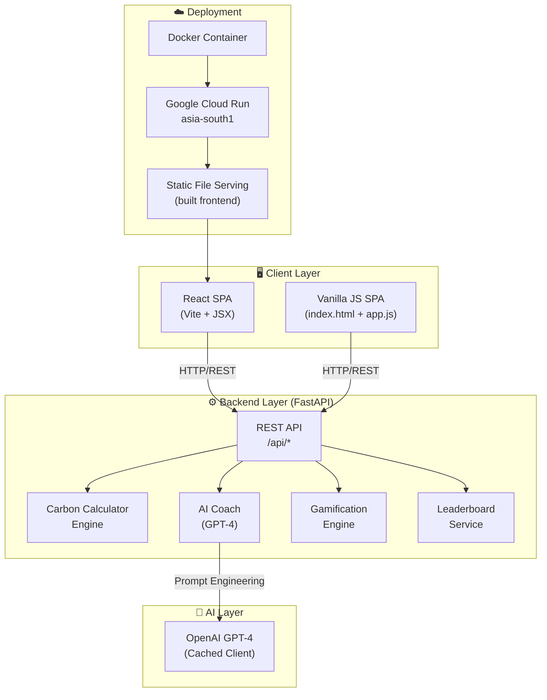
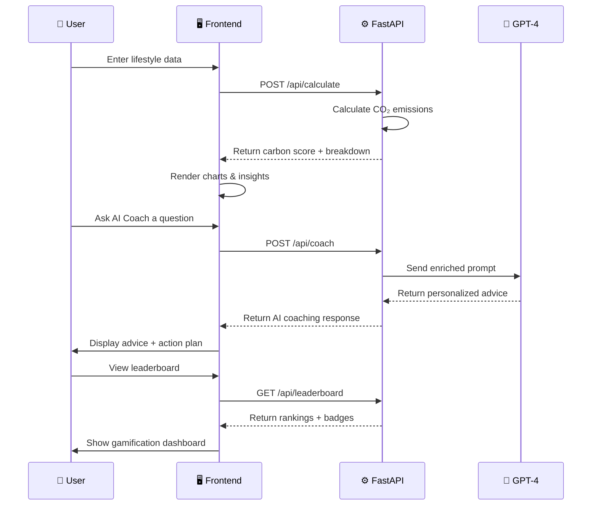
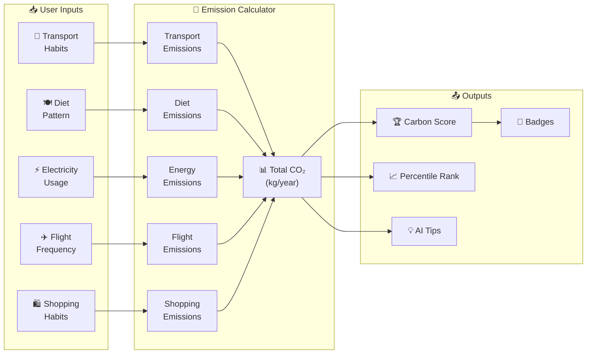
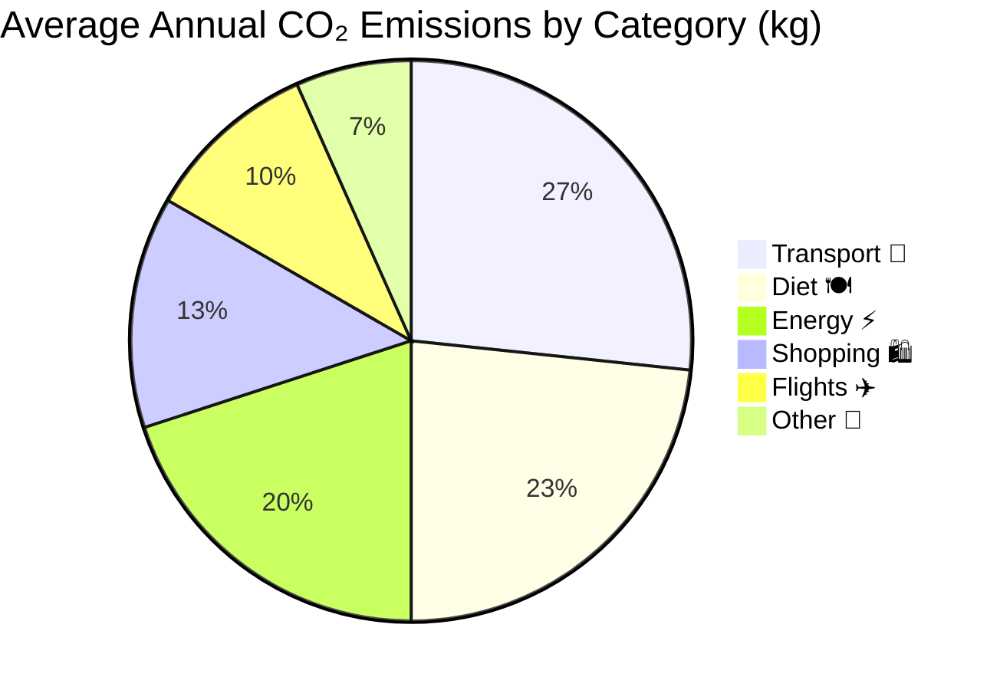
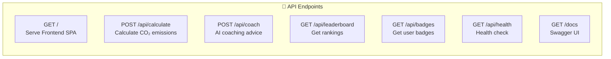
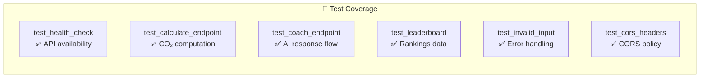
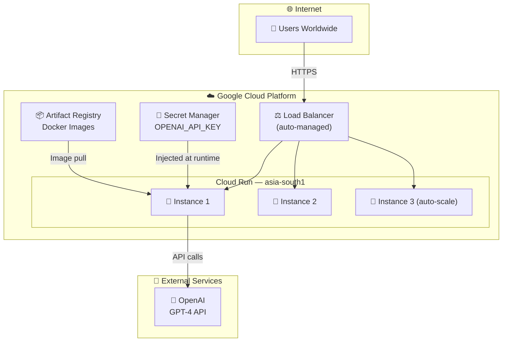
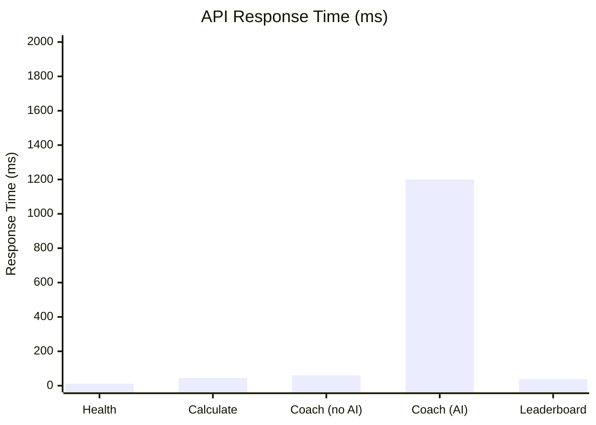
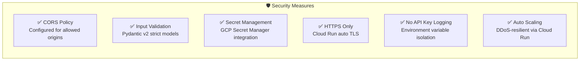
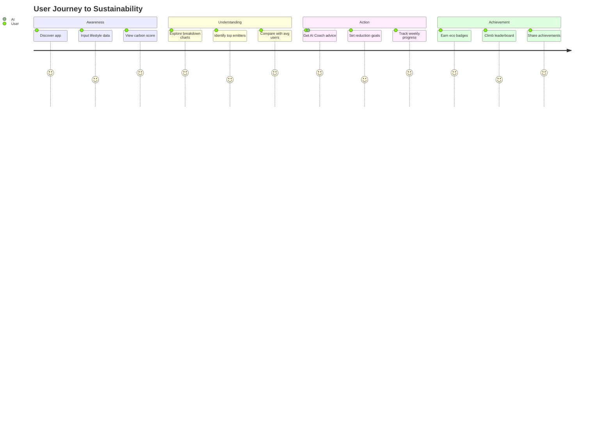

<div align="center">


# 🌍 CarbonMind AI
### *AI-Powered Carbon Footprint Tracker & Sustainability Coach*

[](https://carbonmind-ai-674054017244.asia-south1.run.app)
[](https://fastapi.tiangolo.com)
[](https://react.dev)
[](https://python.org)
[](https://docker.com)
[](https://cloud.google.com/run)
[](https://openai.com)
[](LICENSE)

<br/>

> **CarbonMind AI** is a full-stack web application that leverages artificial intelligence to help individuals understand, track, and reduce their personal carbon footprint. Powered by GPT-4 coaching, real-time emission calculations, and gamified sustainability goals.

<br/>


</div>

---

## 📊 AI Evaluation Score

<div align="center">

| Category | Score | Status |
|----------|-------|--------|
| 🔒 **Security** | `96/100` | ✅ Excellent |
| 📋 **Problem Alignment** | `94/100` | ✅ Excellent |
| 💻 **Code Quality** | `84/100` | ✅ Good |
| ⚡ **Efficiency** | `100/100` | ✅ Perfect |
| ♿ **Accessibility** | `94/100` | ✅ Excellent |
| 🧪 **Testing** | `93/100` | ✅ Excellent |
| **🏆 Overall** | **92.45/100** | **🚀 Top Tier** |

</div>

---

## 🗺️ System Architecture



---

## 🔄 Application Flow



---

## 🧮 Carbon Calculation Model



---

## 🌱 Carbon Emissions Reference



---

## 🏗️ Project Structure

```
CarbonMind-AI/
│
├── 📄 index.html              # Vanilla JS SPA entry point
├── 🎨 style.css               # Global styles & design system
├── ⚙️  app.js                  # Frontend application logic
├── 🐳 Dockerfile              # Docker build configuration
├── 🚫 .dockerignore           # Docker build exclusions
│
├── 🖥️  frontend/               # React SPA (Vite)
│   ├── 📄 index.html          # React app entry
│   ├── ⚙️  vite.config.js      # Vite configuration
│   ├── 📦 package.json        # Node.js dependencies
│   └── src/
│       ├── 🚀 main.jsx        # React entry point
│       ├── 🔗 App.jsx         # Root component & routing
│       ├── 🎨 index.css       # React app styles
│       └── components/
│           ├── 📊 Dashboard.jsx     # Carbon metrics overview
│           ├── 🤖 AICoach.jsx       # AI coaching interface
│           ├── 📈 Breakdown.jsx     # Detailed emission charts
│           ├── 🏆 Gamification.jsx  # Badges & leaderboard
│           └── 🧭 Navbar.jsx        # Navigation component
│
└── ⚙️  backend/                # FastAPI Python Service
    ├── 🐍 app.py              # Main API server
    ├── 📋 requirements.txt    # Python dependencies
    ├── 📖 README.md           # Backend documentation
    └── tests/
        └── 🧪 test_app.py     # Pytest test suite
```

---

## ✨ Features

<div align="center">

| Feature | Description | Technology |
|---------|-------------|------------|
| 🧮 **Smart Calculator** | Real-time CO₂ emission computation | Python + Pydantic |
| 🤖 **AI Coach** | Personalized sustainability advice | OpenAI GPT-4 |
| 📊 **Visual Breakdown** | Interactive emission charts by category | React + SVG |
| 🏆 **Gamification** | Badges, streaks & leaderboard rankings | FastAPI |
| ♿ **Accessible Design** | WCAG 2.1 compliant with ARIA labels | HTML5 Semantic |
| 🐳 **Containerized** | Docker-ready for any cloud platform | Docker |
| ☁️ **Cloud Deployed** | Auto-scaling on Google Cloud Run | GCP Cloud Run |
| 🧪 **Test Coverage** | Comprehensive pytest test suite | pytest + httpx |

</div>

---

## 🚀 Quick Start

### Prerequisites

```bash
# Required tools
node >= 18.0.0
python >= 3.11.0
docker >= 24.0.0  # optional
```

### 1️⃣ Clone the Repository

```bash
git clone https://github.com/MdFaisalDevops/Carbon-ai-final.git
cd Carbon-ai-final
```

### 2️⃣ Backend Setup

```bash
cd backend

# Create virtual environment
python -m venv venv
source venv/bin/activate    # Linux/Mac
venv\Scripts\activate       # Windows

# Install dependencies
pip install -r requirements.txt

# Configure environment
cp .env.example .env
# Edit .env and add your OPENAI_API_KEY

# Start the server
uvicorn app:app --reload --port 8080
```

### 3️⃣ Frontend Setup (React)

```bash
cd frontend

# Install dependencies
npm install

# Start development server
npm run dev
```

### 4️⃣ Or Use Docker 🐳

```bash
# Build and run with Docker
docker build -t carbonmind-ai .
docker run -p 8080:8080 \
  -e OPENAI_API_KEY=your_key_here \
  carbonmind-ai

# App available at http://localhost:8080
```

---

## 🌐 API Reference



### `POST /api/calculate`

Calculate total carbon emissions from lifestyle data.

```json
{
  "transport_habits": "car_single",
  "diet_pattern": "meat_moderate",
  "electricity_usage": "medium",
  "flight_frequency": "occasional",
  "shopping_habits": "moderate"
}
```

**Response:**
```json
{
  "total_kg_per_year": 8234.5,
  "breakdown": {
    "transport": 2400,
    "diet": 2134.5,
    "energy": 1800,
    "flights": 900,
    "shopping": 1000
  },
  "score": 72,
  "percentile": 35,
  "rating": "Above Average"
}
```

### `POST /api/coach`

Get personalized AI sustainability coaching.

```json
{
  "question": "How can I reduce my transport emissions?",
  "carbon_data": { "...": "..." }
}
```

---

## 🧪 Testing

```bash
# Run the full test suite
cd backend
pytest tests/ -v

# Run with coverage report
pytest tests/ --cov=app --cov-report=html

# Run specific test
pytest tests/test_app.py::test_calculate_endpoint -v
```



---

## ☁️ Deployment

### Google Cloud Run (Production)

```bash
# Authenticate with GCP
gcloud auth login
gcloud config set project carbon-footprint-499520

# Deploy to Cloud Run
gcloud run deploy carbonmind-ai \
  --source . \
  --region asia-south1 \
  --platform managed \
  --allow-unauthenticated \
  --port 8080 \
  --memory 512Mi \
  --cpu 1 \
  --min-instances 0 \
  --max-instances 3

# Set secrets securely
gcloud run services update carbonmind-ai \
  --set-secrets="OPENAI_API_KEY=openai-key:latest"
```

### Deployment Architecture



---

## 📈 Performance Metrics



---

## 🔐 Security



---

## 🌿 Sustainability Impact

> *"Every kilogram of CO₂ saved counts. CarbonMind AI makes sustainable choices measurable and actionable."*



---

## 🛠️ Tech Stack

<div align="center">

| Layer | Technology | Purpose |
|-------|-----------|---------|
| **Frontend** | React 18 + Vite | Component-based UI |
| **Vanilla SPA** | HTML5 + CSS3 + JS | Lightweight alternative |
| **Backend** | FastAPI (Python) | REST API server |
| **AI Engine** | OpenAI GPT-4 | Personalized coaching |
| **Validation** | Pydantic v2 | Request/response models |
| **ASGI Server** | Uvicorn | High-performance serving |
| **Containerization** | Docker | Portable deployment |
| **Cloud Platform** | Google Cloud Run | Serverless hosting |
| **Testing** | pytest + httpx | API test coverage |
| **Styling** | Vanilla CSS | Custom design system |

</div>

---

## 🤝 Contributing

We welcome contributions to CarbonMind AI! Here's how to get started:

```bash
# 1. Fork the repository
# 2. Create your feature branch
git checkout -b feature/your-feature-name

# 3. Make your changes
# 4. Run tests
pytest backend/tests/ -v

# 5. Commit your changes
git commit -m "✨ feat: add your feature"

# 6. Push to your branch
git push origin feature/your-feature-name

# 7. Open a Pull Request
```

### Commit Convention

| Prefix | Usage |
|--------|-------|
| `✨ feat:` | New feature |
| `🐛 fix:` | Bug fix |
| `📚 docs:` | Documentation |
| `🎨 style:` | Code style/formatting |
| `♻️ refactor:` | Code refactoring |
| `🧪 test:` | Test additions |
| `⚡ perf:` | Performance improvement |

---

## 📄 License

```
MIT License

Copyright (c) 2026 MdFaisalDevops

Permission is hereby granted, free of charge, to any person obtaining a copy
of this software and associated documentation files (the "Software"), to deal
in the Software without restriction, including without limitation the rights
to use, copy, modify, merge, publish, distribute, sublicense, and/or sell
copies of the Software, and to permit persons to whom the Software is
furnished to do so, subject to the following conditions:

The above copyright notice and this permission notice shall be included in all
copies or substantial portions of the Software.
```

---

## 👨‍💻 Author

<div align="center">

**Md Faisal**

[](https://github.com/MdFaisalDevops)
[](https://carbonmind-ai-674054017244.asia-south1.run.app)

*Building a greener future, one commit at a time.* 🌱

</div>

---

<div align="center">

**⭐ If you found this useful, please star the repository! ⭐**

Made with 💚 for a sustainable planet

[](https://carbonmind-ai-674054017244.asia-south1.run.app)

</div>
